<h1>Technologie Chmurowe - Zadanie 1</h1>
<h2>Część obowiązkowa</h2>
<h3>Autor: Michał Moń</h3>
<h4>Opis repozytorium:</h4>

Repozytorium składa się z katalogu "src", czyli kodu źródłowego serwera oraz pliku Dockerfile.  
Serwer został napisany w języku JavaScript z wykorzystaniem serwera Express oraz biblioteki Axios. Wykorzystuje on również API <a href="https://ipwhois.io/" target="">ipwhois</a> w celu otrzymania adresu IP, za pomocą którego zostaje wyznaczona strefa czasowa. Serwer domyślnie nasłuchuje na porcie 5000. 

<h4>Użyte polecenia:</h4>
<ol>
<li><b>docker buildx create --name builder1</b> - utworzenie nowego buildera o nazwie "builder1"</li>
<li><b>docker buildx use builder1</b> - przekazanie informacji do buildx, aby używał buildera "builder1"</li>
<li><b>docker buildx inspect --bootstrap</b> - wyświetlenie inforamcji o builderze oraz uruchomienie go</li>
<li><b>docker buildx build -f Dockerfile -t michalmon/tch-z1:test --platform linux/arm/v7,linux/arm64/v8,linux/amd64 --push .</b> - zbudowanie obrazu na architektury: linux/arm/v7, linux/arm64/v8, linux/amd64 (zgodnie z poleceniem) oraz nadanie obrazowi nazwy "michalmon/tch-z1:test" i wypchnięcie go do repozytorium na Dockerhub (michalmon/tch-z1) Link: <a href="https://hub.docker.com/repository/docker/michalmon/tch-z1">Repozytorium Dockerhub</a></li>
<li><b>docker run -d -p 5000:5000 --name test1 michalmon/tch-z1:test</b> - uruchomienie kontenera z obrazem na porcie 5000</li>
<li><b>docker logs test1</b> - wyświetlenie z logów informacji o autorze, czasie uruchomienia i porcie, na którym nasłuchuje serwer</li>
<li><b>docker history michalmon/tch-z1:test</b> - wyświetlenie informacji o warstwach obrazu</li>
</ol>
<h4>Zrzuty ekranu:</h4>
<h5>Polecenia 1-3:</h5>
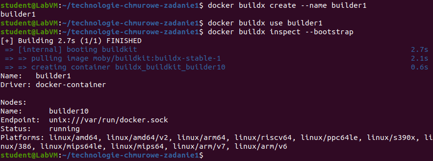
<h5>Polecenie 4:</h5>
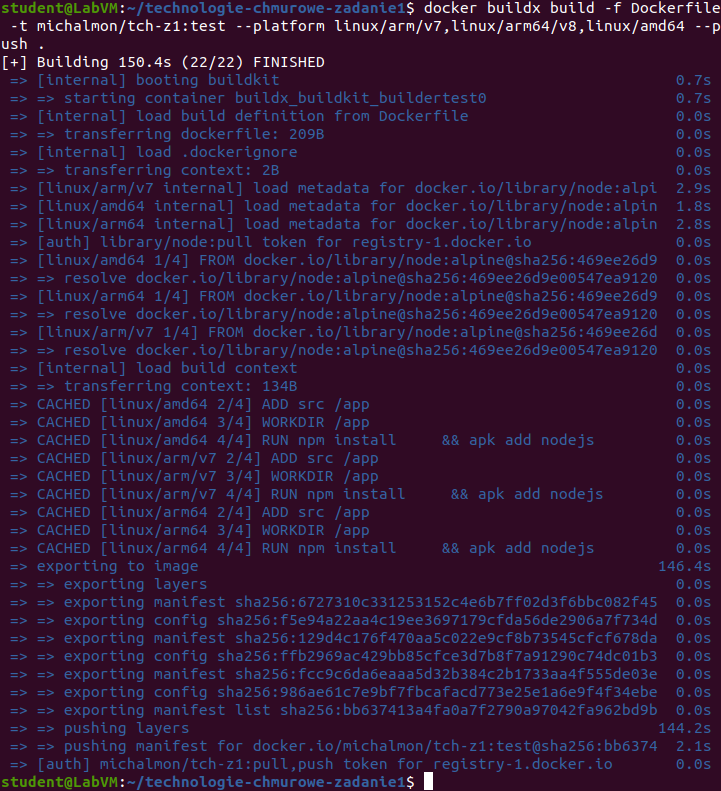
<h5>Polecenie 5:</h5>
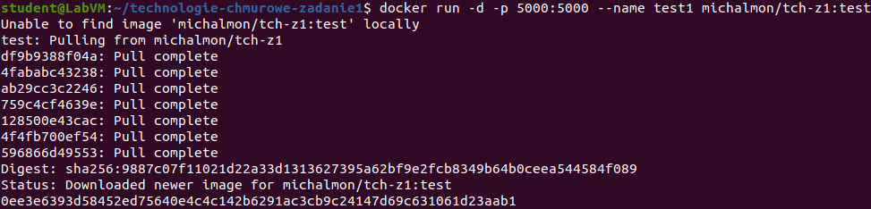
<h5>Polecenie 6:</h5>
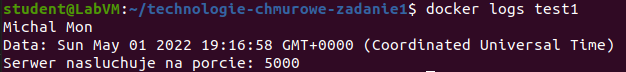
<h5>Polecenie 7:</h5>
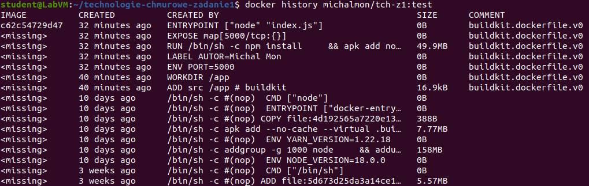
<h4>Działanie:</h4>
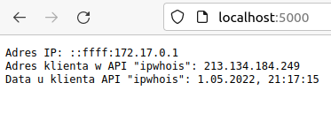

<h2>Część dodatkowa - Dodatek 1</h2>

Workflow zostaje wyzwolony w przypadku wypchnięcia na gałąź "main" Runner: ubuntu-latest 

<h4>Etapy:</h4>
<ol>
<li><b>"actions/checkout@v3"</b> - walidacja dostępu workflow do repozytorium</li>
<li><b>"docker/setup-buildx-action@v1.6.0"</b> - konfiguracja Buildx</li>
<li><b>"docker/setup-qemu-action@v1.2.0"</b> - QEMU prowadzi instalację na wielu architekturach</li>
<li><b>"docker/login-action@v1.14.1"</b> - logowanie do konta Dockerhub</li>
<li><b>"docker/login-action@v1"</b> - logowanie do GitHub Registry</li>
<li><b>"actions/cache@v2"</b> - umożliwienie tworzenia cache</li>
<li><b>"docker/build-push-action@v2"</b> - zbudowanie i wypchnięcie obrazów na Dockerhuba</li>
<li><b>"Cache update"</b> - skrypt, który pozwala na zaktualizowanie cache</li>
</ol>

<h4>Zrzuty ekranu poszczególnych etapów workflow:</h4>
<h5>Etapy 1-3:<h5>
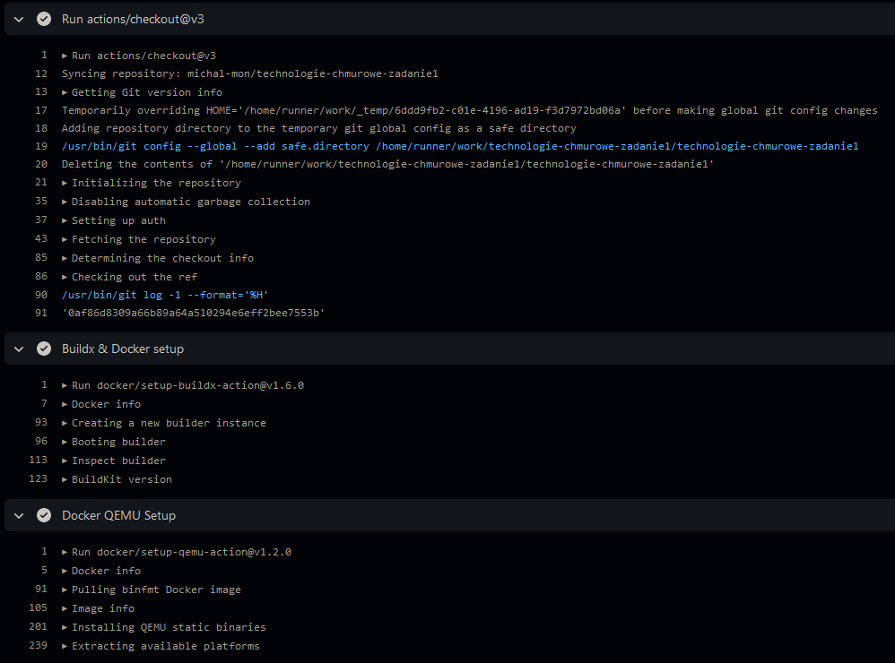
<h5>Etapy 4-6:<h5>
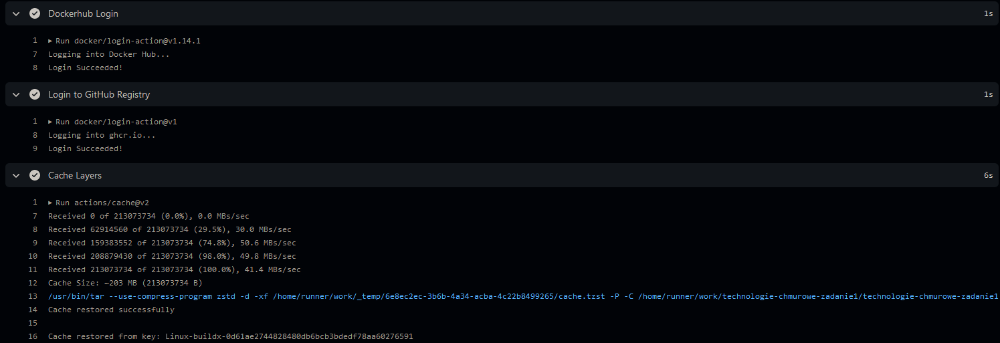
<h5>Etap 7 (fragment):<h5>
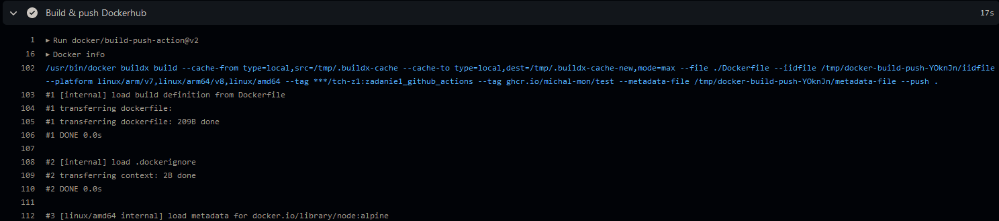
<h5>Etapy 8:<h5>
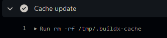
<h5>Wszystkie etapy:<h5>
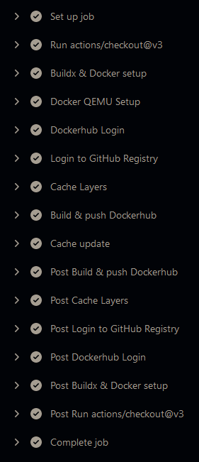
